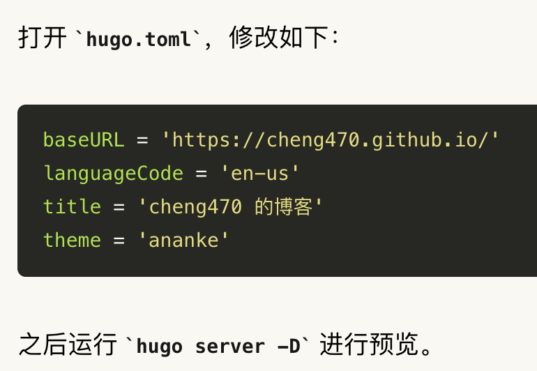

+++
date = '2025-09-18'
draft = false
title = 'Hugo 没有转换行内代码'
description = "记录自己使用 Hugo 搭建博客的过程"
tags = [
    "tech",
    "hugo",
]
+++

## 问题

之前的文章对Markdown行内代码和块代码的展示效果如下：



这里行内代码保持了原来的样子，用反引号括起来。

期望的效果是单行代码样式，就是有个边框的样子。

## 原因定位

### 1 hugo转换的问题？

网上找到这个帖子：[What happened to inline code highlighting? - support - HUGO](https://discourse.gohugo.io/t/what-happened-to-inline-code-highlighting/44342)

里面提到：

> … was never syntax highlighted by Hugo.
> 
> Perhaps you were/are using a theme with a JavaScript highlighter. If so, you’ll need to raise an issue with the theme author.

hugo 并不负责代码高亮，而是由具体的主题负责。

通过浏览器检查了下 `html` 代码，确实转成 `<code>` 标签了，反引号是由 `main.min.css` 样式文件引入的：

```css
/* main.min.css 内容 */
.prose {
    :where(code):not(:where([class~="not-prose"],[class~="not-prose"] *))::before {
        content: "`";
    }
}
.prose {
    :where(code):not(:where([class~="not-prose"],[class~="not-prose"] *))::after {
        content: "`";
    }
}
```

这个样式文件是我目前使用的 `paper` 主题里面的。

### 2 paper主题样式的问题？

很容易就到 `paper` 的 `github issue` 找到讨论帖子： [Inline code is not styled properly · Issue #226 · nanxiaobei/hugo-paper](https://github.com/nanxiaobei/hugo-paper/issues/226)

里面提到：

> hugo-paper uses <https://github.com/tailwindlabs/tailwindcss-typography> to style the content, it was designed to be that way by the control of tailwind

`paper` 主题的样式使用的是 ``@tailwindcss/typography`` 工具，这是 `Tailwind CSS` 的插件，用于文字排版。

### 3 typography 的问题？

从 [Tailwind CSS Typography](https://tailwindcss-typography.vercel.app/) 中找到作者对该工具的介绍，里面介绍 `inline code` 时说道：

> We also need to make sure inline code looks good, like if I wanted to talk about `<span>` elements or tell you the good news about `@tailwindcss/typography`.
>
> Sometimes I even use code in headings
>
> Even though it's probably a bad idea, and historically I've had a hard time making it look good. This "wrap the code blocks in backticks" trick works pretty well though really.

翻译：

> 我们还需要确保内联代码看起来不错，就像我想谈论`<span>`元素或告诉你有关 `@tailwindcss/typography` 的好消息一样。
>
> 有时我甚至想在标题里使用代码
>
> 尽管这可能是一个坏主意，而且从历史上看，我很难让它看起来不错。不过，这种“将代码块包装在反引号中”的技巧效果很好。

:joy: 作者觉得效果很好，那就很好吧，就这样子吧。

## 参考

- [Tailwind CSS Typography](https://tailwindcss-typography.vercel.app/)

